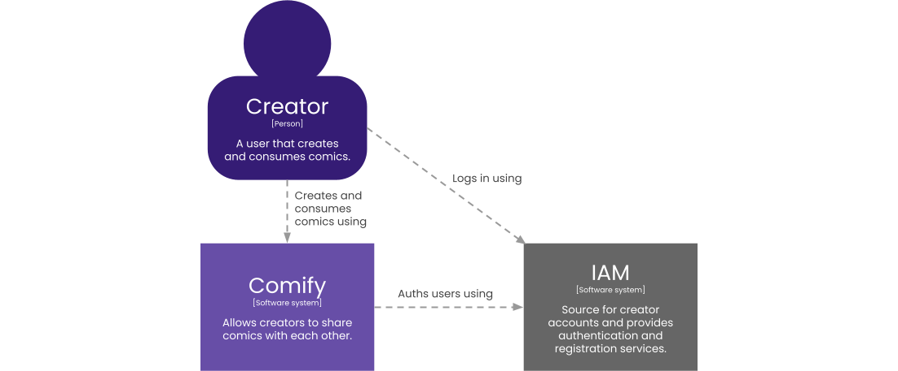
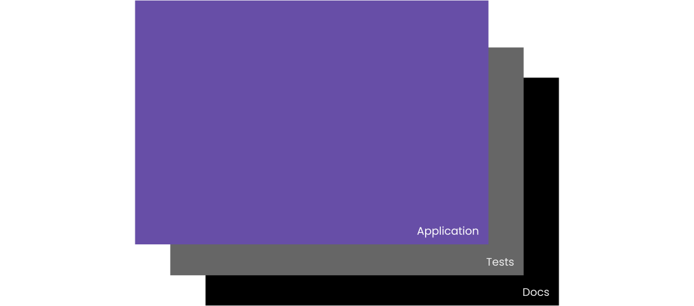
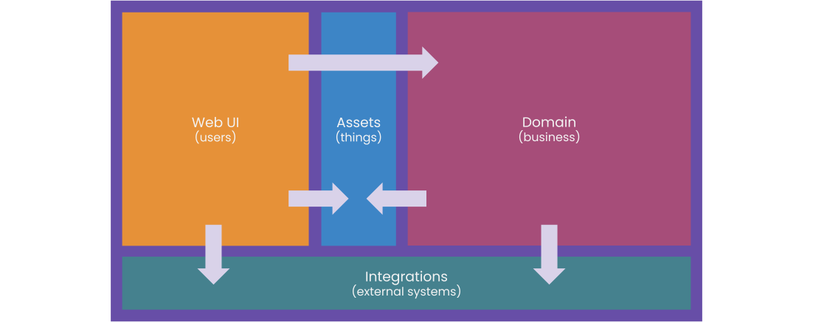

# Comify docs

Hi, welcome to the Comify documentation. 👋

Here you'll find all the technical details on how we are building the application. We'll start with the fundamentals below. From there you can zoom in at any part for the details.

## Technology stack

The project is 100% [TypeScript](https://www.typescriptlang.org/) based.

**Runtime requirements**

* [Node.js](https://nodejs.org/) as runtime (version 20+).
* [Docker](https://www.docker.com/) for additional services.

**Main dependencies**

* [Jitar](http://jitar.dev) for E2E communication and scaling concerns.
* [React](https://react.dev) for the frontend.

All backend components are written in pure TypeScript without a framework.

**Additional services**

* [MongoDB](https://www.mongodb.com/) as database.
* [MinIO](https://min.io/) as file store (images).
* [Keycloak](https://www.keycloak.org/) as identity and access manager.

## Architecture

At the heart of any application lies architecture. To explain ours, we found inspiration from the [C4 model](https://c4model.com/) and added our own sauce.

### Context

Comify runs as a stand-alone application and hasn't many external dependencies (yet?). The most important one is the `Creator` that represents the end-user. Without it, the application doesn't have any value. Secondly we're outsourcing the identity and access management (IAM) to save on development that doesn't add business value.

**Note** We use OpenID Connect for the IAM integration.

### Shadows

The application has two shadows. Each shadow contains content related to the application.

If you're reading this, then you've already found the docs. This is the darkest shadow, because it's the furthest away from the code. The tests are more code related, and can be found in the `test` folder in the project root. The application itself is placed in the `src` folder also in the project root.

The structure of the shadows mimic the application structure to make navigating them easy. This structure is explained in the containers section below.

### Containers

The application is divided into multiple parts, called containers. We have these four.

Let's look at their usages and responsibilities.

* [**Web UI**](./webui/) - Contains the web based interface for user interaction (SPA).
* [**Assets**](./assets/) - Contains shared things like images, downloads, etc...
* [**Domain**](./domain/) - Contains business related components like use-case logic, data entities, etc..
* [**Integrations**](./integrations/) - Contains implementations for IAM, database, etc..

Echt part has its own folder in the application (and its shadows). For more detailed information you can click on their names.

## Configuration

The application has several configuration options. You can find them here.

### Environment

For both the application and Docker services we've set up environment variables that can be managed from a single configuration file. An example of this file is located in the root of the project with the name `example.env`.

### Segments

The domain container can be split into multiple segments for scalability reasons like deployment, load balancing and fail over. This is feature provided by Jitar, more information on this can be found in [its documentation](https://docs.jitar.dev/deploy/segmentation.html). The configuration files can be found in the `segments` folder in the project root.

We use a backend for frontend (BFF) segmentation strategy. The `webui.segment.json` file exposes all functions that can be remotely accessed by the frontend. All the other segment files are for future purposes and currently unused.

### Services

Jitar provides [multiple services](https://docs.jitar.dev/fundamentals/runtime-services.html) to deploy applications with different strategies. Currently, we only use the standalone service for running the application as a monolith. It's configuration file can de found in the `services` folder in the project root.

The `standalone.json` configuration file configures two script for setting up and tearing down the IAM and storage services, registering health checks for the services and middleware for the authentication.

## Getting started

Before you start, make sure you meet all the runtime requirements. Follow these instructions next.

1. Run `npm install` from a terminal to install the dependencies.
1. Copy the `example.env` file to a `development.env` file.
1. Run `npm run build` to build the application.
1. Run `npm run standalone` to run Jitar at port 3000.

To start the application you need to open a new terminal and run `npm run dev`. Now a [Vite](https://vitest.dev/) dev server is running on port 5173. You can then navigate to http://localhost:5173 to open the application.

To stop the application you can press CONTROL+C in both terminals.

### Build & start

To build and run the application you can keep using the `npm run build` and `npm run standalone` commands. For convenience both commands are combined in the following command: `npm run rebuild`.

### Test & check

To run the tests you can use the `npm run test` command. You can also run the linter with the `npm run lint` command. For convenience the `build`, `test` and `lint` commands are combined in the following command: `npm run review`.
