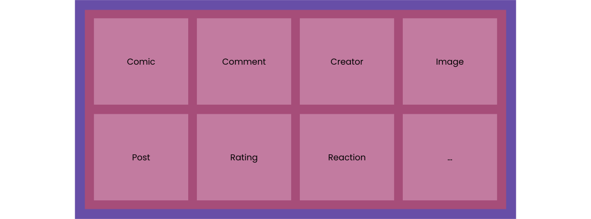

# Domain | Comify docs

The domain contains the implementation of all business related components. It leverages a procedural approach using [Jitar](https://jitar.dev).

## Module structure

We're using a feature-oriented approach. Our root module structure looks like this.

Basically, it boils down to a root module per domain concept. Each module contains its features.

A module is implemented as a folder containing an index file that exposes its essentials for consumers.

## Features

A feature is a sub-module containing all components required for its implementation. Features vary in size, ranging from small (single components) to large (multiple components), depending on the requirements.

Every feature exposes its main function as the default export through the index file. Additionally, its types, errors, etc., can be exposed if their consumers require them.

We aim to keep features as autonomous as possible by encapsulating their internal components. If another feature requires the same component (such as retrieving data by ID), we tend to make a copy on the first occurrence and move the component to its own feature upon multiple occurrences. This decision heavily depends on the complexity of the component.

## Components

Components can have different types depending on their responsibilities. Currently, we distinct the following types:

* **Process** - a series of steps, where each step is a separate component.
* **Task** - handles calculations, data manipulations, etc.
* **Persistence** - responsible for querying, inserting, and updating the database.
* **Aggregation** - gathers all related data.
* **Validation** - ensures incoming data meets the required criteria.
* **Event** - handles publications and subscriptions.

Each component is implemented in its own file and exported as the default.

A feature typically contains a combination of these component types. Process components that perform multiple database writes follow the [SAGA pattern](https://microservices.io/patterns/data/saga.html) as described in the [Jitar documentation](https://docs.jitar.dev/develop/data-consistency.html).

## Data

Data is defined per domain concept. We distinguish between two types:

* **Persistent** - data stored in the database.
* **Aggregated** - a data view containing all referenced data.

Both types are defined as TypeScript types with read-only fields to ensure immutability.

Persistent data is defined in the `types.ts` file in the root of the domain concept folder, as it is used by multiple features. Aggregated data is defined in the `types.ts` file of the aggregation feature, as it is more specific.

Persistent data is read and written by persistence components using the database integration.

## Events

We use a publish/subscribe model for side effects such as updating counters, creating notifications, etc.

Features that trigger side effects contain both a **publish** and **subscribe** component. Both components use the event broker integration to manage events.

The publish component is used as the last step in the process. The subscribe component is exported in the feature's index file for use by other features.

Features leverage a **subscriptions** component that imports and uses the subscribe components of other features. The subscriptions component is also exported in the feature's index file.

## Definitions

Every module (domain, concept, and feature) can have two types of definitions:

* **Types** - TypeScript types such as data and event definitions, defined in the `types.ts` file.
* **Definitions** - constants such as enums, validation schemas, record types, etc., defined in the `definitions.ts` file.

The location of a definition depends on its scope of use. For example, the base data model is located in the domain root module, a record type is defined per domain concept, and a validation schema is defined per validation feature.
