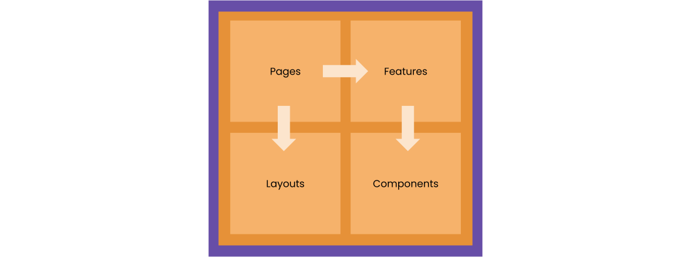
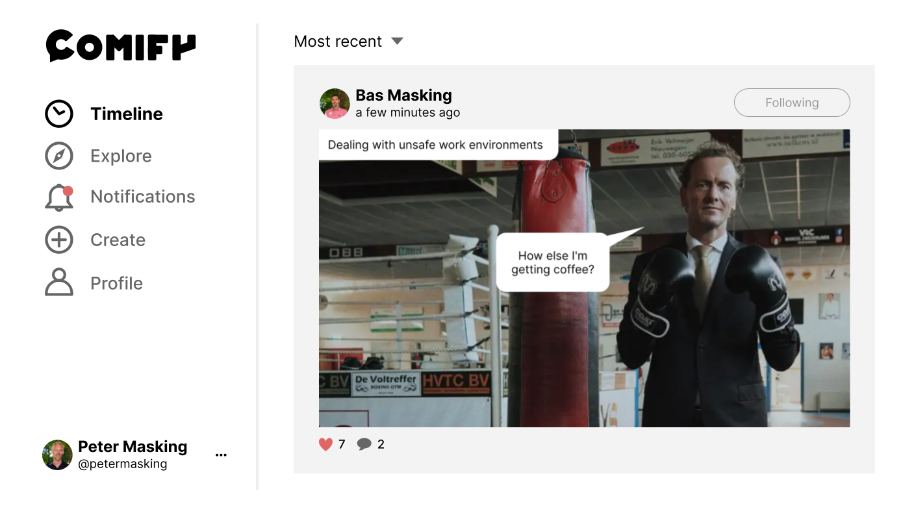

# Web UI | Comify docs

The Web UI container contains the web based interface for user interaction. It's set up as a single page application (SPA) using [React](https://react.dev).

## Module structure

We're using a modular composable approach for building this part of the application. The basic module structure looks like this.

Let's look at their usages and responsibilities.

* **Layouts** - templates for building pages.
* **Pages** - composition of features.
* **Features** - interactive composition of components.
* **Components** - small reusable building blocks.

Each module has its own folder in the `webui` folder and exports its components in an `index.ts` file.

Besides these, there are some additional modules.

* **Context** - custom React context providers
* **Design system** - our own simple design system (details provided later)
* **Editor** - implementation of the comic editor
* **Hooks** - custom React hooks
* **Utils** - custom React utils

## Composition model

The following example shows the graphical design of the UI showing the users timeline containing comics from followed users.

We'll use this design to explain the composition from layout till components.

### Layout

A layout only provide containers for content and do not contain any content themselves. We currently have two layouts:

1. **Centered** - centers all content both vertically and horizontally.
2. **Sidebar** - two-column layout with a 100% height and centered horizontally.

The example clearly shows the **Sidebar** layout.

### Page

Each page picks a layout and fills its containers. We have a single page per layout because we're using feature based routing:

1. **Guest** - for non-logged in users (centered layout).
1. **Application** - for logged in users (sidebar layout).

The example shows the **Application** page. This page has a fixed sidebar coming from the components module. The content is a feature coming from the router.

### Feature

Features compose components and make them work as a functional whole. For the largest part the features are implementations of a use-case, like the **Timeline** showed in the example. The other main features are:

* **Explore** - posts and creators the user isn't following yet.
* **Notifications** - of likes, reactions, followers, etc..
* **Create** - a new post.
* **Profile** - the users posts, followers and following.

These features can link to, or contain, sub-features like **PostDetails**, **Reactions**, etc..

At the composition of a feature, actions need to be defined for the components. For example, what needs to happen when the ordering of the overview has changed, or when the follow button is pressed. All available actions are provided as hooks (from the `hooks` module), so they only need to be imported and linked. For example, the `useEstablishRelation` hook is liked as action for the follow button.

A feature is also responsible for loading data. For this, hooks are also available like the `useTimelinePosts` hook used for this feature.

### Components

Components are small reusable building blocks grouped per domain concept. To keep them small, we break them down into smaller pieces. Conceptually we distinguish two types of components:

1. **Public** - shared components for building features.
1. **Elementary** - private components for building public components.

Our basic design rule: components are dumb! A component can define actions, but does not implement them. Features will provide the implementation, because they know the context of use.

Also, public components can be bound to a domain view model. Elementary components can not because they are even dumber.

### Design system

At the core of the design lies a design system that we use for building the pages, features and components. When done correctly,you won't find a trace of standard HTML in them.

The design system consists for the most part of a set of elements like a button, panel, etc.. But it also has interactive components like a dropdown and tabs. A full description of the design system can be found in a [separate document](./DESIGNSYSTEM.md).

## Other topics

### Routing

The routes can be found in the `Routes.tsx` file in the root of the webui folder. They are used in the `App` components that is also placed in the root folder.

### Contexts

Currently we only a single context for the application. The `AppContext` only provides the identity of the user. We try to limit the number of contexts, so we hope we can leave it like this.

### Server communication

All server communication comes from hooks. A hook is allowed to import and execute a domain function, like establishing a relation.

Because we're using Jitar, we can import and call the functions directly and don't have to build API requests.

Many of the domain functions require a requester object for authorization purposes. We've created a `johnDoe` object to act as placeholder when calling these functions. The authentication middleware will replace this object with the actual requester.
